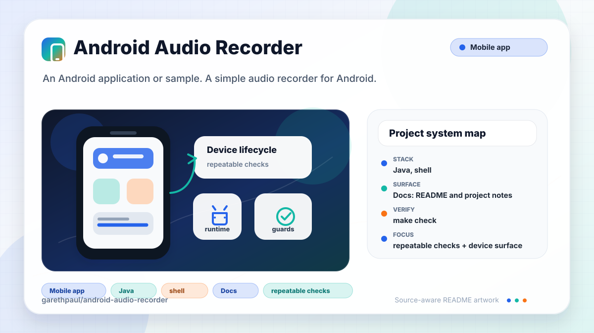

# android-audio-recorder

<!-- README-OVERVIEW-IMAGE -->


## Overview

`garethpaul/android-audio-recorder` is an Android application or sample. A simple audio recorder for Android.

This README is based on the checked-in source, manifests, scripts, and repository metadata on the `master` branch. The project language mix found during review was: Java (2), shell (1).

## Repository Contents

- `README.md` - project overview and local usage notes
- `.github/workflows/check.yml` - GitHub Actions baseline for `make check`
- `build.gradle` - Android or Gradle build configuration
- `app` - source or example code
- `docs` - source or example code
- `gradle` - source or example code
- `gradlew` - Android or Gradle build configuration
- `scripts` - source or example code
- `SECURITY.md` - security reporting and disclosure guidance
- `VISION.md` - project direction and maintenance guardrails

Additional scan context:

- Source directories: app, docs, gradle, scripts
- Dependency and build manifests: build.gradle, gradlew
- Entry points or build surfaces: Gradle build files
- Test-looking files: app/src/androidTest/java/gpj/android_recorder/ApplicationTest.java

## Getting Started

### Prerequisites

- Git
- Android Studio or a compatible Android SDK
- Gradle or the checked-in Gradle wrapper when present

### Setup

```bash
git clone https://github.com/garethpaul/android-audio-recorder.git
cd android-audio-recorder
scripts/check-baseline.sh
./gradlew lint --no-daemon
./gradlew test --no-daemon
./gradlew assembleDebug --no-daemon
```

The setup commands above are derived from repository files. Legacy mobile, Python, or JavaScript samples may require older SDKs or package versions than a modern workstation uses by default.

## Running or Using the Project

- Use Android Studio to open the project or run `./gradlew assembleDebug` when the Android SDK is configured.

## Testing and Verification

- `make check` - runs the source baseline and Android SDK-backed Gradle checks
  when `ANDROID_HOME` or `ANDROID_SDK_ROOT` is configured
- `scripts/check-baseline.sh` - runs SDK-free recorder baseline checks
- GitHub Actions runs `make check` on pushes and pull requests. On hosted
  Linux runners without the legacy Android SDK, the SDK-free baseline still
  runs and Gradle gates report clear skips. The workflow uses Ubuntu 24.04 and
  cancels superseded runs.
- Local Gradle checks accept an explicit `ANDROID_HOME` or `ANDROID_SDK_ROOT`;
  the repository does not assume a maintainer-specific SDK location.
- The baseline check protects media cleanup, play/record dispatch, and
  first-render button icon state.
- Recorder startup guards optional action-bar and record/play control lookups
  before wiring button listeners.
- Recorder controls remain in their idle state after record/play startup failures
  instead of switching to active recording or playback controls.
- Recorder lifecycle cleanup resets field-backed recording and playback control
  state so released media resources do not leave stale stop controls on screen.
- Recorder lifecycle cleanup routes active capture and playback through guarded
  stop methods before release, allowing recording containers to finalize.
- Recorder controls keep playback hidden after recording finalization failures
  instead of presenting an incomplete capture as playable.
- Playback completion resets the play control to idle and releases the player
  without requiring an extra stop tap.
- Recorder playback errors release the player and reset controls to idle rather
  than leaving the stop icon visible for a failed playback session.
- `./gradlew lint --no-daemon`, `./gradlew test --no-daemon`, and `./gradlew assembleDebug --no-daemon` when the Android SDK is configured

When the required SDK or runtime is unavailable, use static checks and source review first, then verify on a machine that has the matching platform toolchain.

## Configuration and Secrets

- No required secret or credential file was identified in the repository scan. If you add integrations later, keep secrets out of git.
- The recorder disables Android backup in the checked-in manifest so local app
  state associated with recordings is not backed up by default.
- Recordings are stored under app-specific external files with an internal
  storage fallback; the checked-in manifest keeps only microphone permission.

## Security and Privacy Notes

- Review changes touching network requests, sockets, or service endpoints; examples from the scan include app/src/androidTest/java/gpj/android_recorder/ApplicationTest.java, app/src/main/AndroidManifest.xml, app/src/main/res/layout/activity_main.xml, gradle.properties.
- Review changes touching mobile permissions or privacy-sensitive device data; examples from the scan include app/src/main/AndroidManifest.xml, docs/plans/2026-06-08-recorder-build-tools-baseline.md, docs/plans/2026-06-08-recorder-lint-resource-baseline.md, docs/plans/2026-06-08-recorder-playback-baseline.md, and 1 more.
- Review changes touching file, media, JSON, XML, CSV, OCR, or data parsing; examples from the scan include app/lint.xml, app/src/main/AndroidManifest.xml, app/src/main/res/values-w820dp/dimens.xml, docs/plans/2026-06-08-recorder-lint-resource-baseline.md, and 1 more.
- Review changes touching database, model, or persistence code; examples from the scan include docs/plans/2026-06-08-recorder-build-tools-baseline.md.

## Maintenance Notes

- This looks like a legacy Android project or sample. Expect Android SDK, Gradle, and support-library versions to matter.
- See `SECURITY.md` for vulnerability reporting and safe research guidance.
- See `VISION.md` for project direction and contribution guardrails.
- See `docs/plans/2026-06-08-recorder-check-wrapper.md` for the root
  verification wrapper baseline.
- See `docs/plans/2026-06-09-recorder-button-icon-contracts.md` for the
  first-render button icon contract.
- See `docs/plans/2026-06-09-recorder-startup-control-guards.md` for action-bar
  and record/play control lookup guards.
- See `docs/plans/2026-06-09-recorder-backup-policy.md` for the manifest
  backup policy contract.
- See `docs/plans/2026-06-09-recorder-app-specific-storage.md` for the
  recording storage contract.
- See `docs/plans/2026-06-09-recorder-startup-ui-state.md` for the media
  startup-failure UI state contract.
- See `docs/plans/2026-06-09-recorder-playback-completion-ui.md` for the
  playback completion UI reset contract.
- See `docs/plans/2026-06-09-recorder-recording-lifecycle-reset.md` for the
  recording-state lifecycle reset contract.
- See `docs/plans/2026-06-09-recorder-playback-error-ui.md` for the playback
  error UI reset contract.
- See `docs/plans/2026-06-10-ci-baseline.md` for the lightweight GitHub
  Actions baseline.

## Contributing

Keep changes small and tied to the project that is already present in this repository. For code changes, document the toolchain used, avoid committing generated dependency directories or local configuration, and update this README when setup or verification steps change.
